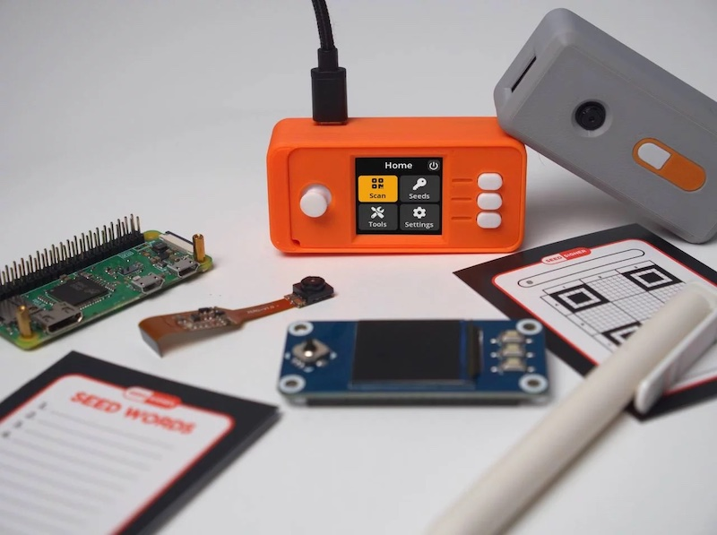

# SeedSigner

> Open-source, air-gapped Bitcoin signing device built from off-the-shelf hardware for around $50.

SeedSigner is a do-it-yourself Bitcoin signing device. You assemble it from three inexpensive, general-purpose components, flash an open-source operating system onto a microSD card, and you have a fully functional tool to **generate seed phrases, export public keys, and sign transactions — all without ever connecting to a network.** It communicates exclusively through QR codes, using a camera to read and a screen to display.

## Why SeedSigner?

- **Air-gapped by design:** Built on the Raspberry Pi Zero v1.3, a board with **no Wi-Fi or Bluetooth hardware**. It cannot connect to a network even if compromised software tried to. Data moves only through the camera (in) and the screen (out), as QR codes.
- **Stateless:** Your private keys exist only in volatile RAM while the device is powered on. There is no secure element, no encrypted storage, no flash memory holding secrets. Pull the plug and everything is erased. If the device cannot remember your keys, it cannot leak them.
- **Affordable and discreet:** The bill of materials is roughly $50, all generic electronics. Nothing about the parts signals "Bitcoin" to a merchant, a courier, or anyone who sees the package.
- **Fully open source:** Every line of Python and every hardware schematic is publicly auditable and published under the MIT license. No proprietary chips or black-box firmware control key operations.
- **Multi-sig ready:** One device can sign for multiple keys, making multi-signature wallets practical and affordable.

## What it can do

| Task | Description |
|------|-------------|
| **Generate a seed** | Create a new BIP-39 seed phrase from camera entropy, dice rolls, or manual word selection |
| **Load a seed** | Enter an existing seed by typing words or scanning a SeedQR |
| **Export an xpub** | Derive and display an extended public key so your coordinator can build a watch-only wallet |
| **Sign a PSBT** | Scan an unsigned transaction, review it on screen, and produce a signed QR |
| **Create a SeedQR** | Encode your seed phrase into a compact QR for fast future loading |
| **Explore & verify addresses** | Browse receiving and change addresses, and confirm an address belongs to your wallet |
| **Calculate the final word** | Enter 11 or 23 words and compute the valid checksum word |

## How it works

SeedSigner is the **signer** in a signer-plus-coordinator setup. It holds private keys temporarily and produces signatures; it never touches the Bitcoin network. You pair it with a **coordinator:** a wallet app on a networked computer or phone that builds transactions, manages addresses, and broadcasts to the network.

<figure class="ss-diagram ss-arch" aria-label="How SeedSigner communicates with a coordinator: only QR codes cross the air gap">
  

    

      Networked computer
      <strong class="ss-node-title">Coordinator</strong>
      Sparrow, Specter, BlueWallet&hellip;
    

    

      Air gap
      &#9668;&nbsp;QR codes&nbsp;&#9658;
    

    

      Air-gapped device
      <strong class="ss-node-title">SeedSigner</strong>
      the signer
    

    
&#8595; talks to the <strong>Bitcoin network</strong>

    

    
&#8595; holds <strong>private keys in RAM only</strong> &mdash; never stored on disk

  

</figure>

1. Your coordinator (such as Sparrow) builds an unsigned transaction.
2. It displays the transaction as an animated QR code.
3. SeedSigner scans the QR, shows you the details, and signs it.
4. SeedSigner displays a new QR containing the signature.
5. Your coordinator scans that QR and broadcasts the transaction.

No cables. No wireless. Just light. Popular coordinators include [Sparrow Wallet](https://sparrowwallet.com) (desktop), [Specter Desktop](https://specter.solutions) (desktop, requires a node), [BlueWallet](https://bluewallet.io) (mobile), [Nunchuk](https://nunchuk.io), and [Keeper](https://bitcoinkeeper.app) — see [Compatible wallets](/help/compatible-wallets.md).

## Who is SeedSigner for?

- **New Bitcoiners** who want affordable self-custody with solid security defaults.
- **Privacy-conscious users** who prefer hardware that cannot phone home.
- **Multi-sig users** who need multiple signers without buying multiple expensive hardware wallets.
- **Developers and tinkerers** who want to audit, modify, or extend a signing device.
- **Bitcoiners in restrictive jurisdictions** who need discreet, unrecognizable hardware.

## Where to start

New here? Head to **[Get Started](/get-started/)** and pick the path that matches what you want to do.

| I want to… | Go to |
|------------|-------|
| Build a SeedSigner from parts and boot it | [Build your device](/get-started/build-device.md) |
| Generate a seed and set up my first wallet | [Create your first wallet](/get-started/first-wallet.md) |
| Generate and verify a receive address | [Receive bitcoin](/get-started/receive.md) |
| Sign and broadcast a transaction | [Send bitcoin](/get-started/send.md) |
| Restore a wallet from a backup | [Recover from backup](/get-started/recover.md) |
| Set up a multi-signature wallet | [Set up multisig](/get-started/multisig.md) |
| Look up a specific screen or setting | [Reference](/reference/hardware/components.md) |

## Important security notice

> **Bitcoin transactions are irreversible.** Always verify recipient addresses and amounts on SeedSigner's own screen before signing. Practice with testnet before using real funds. See [Security](/security/overview.md) for the full model and best practices.

## Project links

- [SeedSigner on GitHub](https://github.com/SeedSigner/seedsigner)
- [SeedSigner website](https://seedsigner.com)
- [Community Telegram](https://t.me/SeedSigner)
