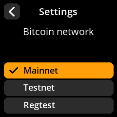

# Using testnet

> Practice your entire custody workflow with free testnet coins before using real Bitcoin.

Bitcoin testnet is a separate Bitcoin network where the coins have zero real-world value. It works exactly like mainnet — same transaction types, same signing process, same wallet software — but with no financial risk.

> **Tip:** We strongly recommend running through your complete custody workflow on testnet at least once before using real bitcoin. This builds confidence and catches setup mistakes early.

---

## What Is Testnet?

Testnet is a parallel Bitcoin blockchain maintained specifically for testing. Testnet coins (tBTC) are freely available and intentionally worthless. Every feature you use on mainnet (single-sig, multi-sig, PSBTs, address verification) works identically on testnet.

---

## Set Up Sparrow Wallet for Testnet

Sparrow Wallet supports testnet natively. Launch it in testnet mode using one of these methods:

**From the command line:**

| Platform | Command |
|----------|---------|
| Windows  | `Sparrow.exe -n testnet` |
| macOS    | `open Sparrow.app --args -n testnet` |
| Linux    | `Sparrow/bin/Sparrow -n testnet` |

**From within Sparrow:**

Go to **Tools > Restart in Testnet**. Sparrow will close and reopen in testnet mode. You'll see a green "Testnet" indicator in the toolbar.

Sparrow automatically connects to a default public testnet server. If you need alternatives, a list of testnet Electrum servers is available at [1209k.com/bitcoin-eye/ele.php?chain=tbtc](https://1209k.com/bitcoin-eye/ele.php?chain=tbtc).

---

## Get Testnet Coins

You need testnet coins to practice sending transactions. Get them free from a faucet:

- **Bitcoin Testnet Faucet:** [bitcoinfaucet.uo1.net](https://bitcoinfaucet.uo1.net)

Paste one of your Sparrow testnet receiving addresses into the faucet, and you'll receive testnet coins within a few minutes (once the transaction confirms).

> **Tip:** Testnet block times can be irregular. Don't worry if confirmation takes longer than the usual 10 minutes — this is normal for testnet.

---

## Switch SeedSigner to Testnet

By default, SeedSigner operates on mainnet. To switch to testnet:

1. Navigate to **Settings > Advanced > Bitcoin Network**.

   

2. Select **Testnet**.

   

   For comparison, this is the same screen on mainnet:

   

SeedSigner will now generate testnet addresses and sign testnet transactions.

**The visual indicator.** Any screen showing an amount renders it in **green** and
labels it **tSats** (or tBTC) rather than the usual orange sats. Addresses start
`tb1q…` instead of `bc1q…`, and screens that name the wallet type append
"(Testnet)". Between them you always know which network you are on:

> **Warning:** Remember to switch SeedSigner back to mainnet when you're done testing. You don't want to accidentally generate testnet addresses for real funds.

---

## Practice Your Full Workflow

With testnet set up on both Sparrow and SeedSigner, walk through your entire custody process:

1. **Create a seed** on SeedSigner (or load an existing test seed).
2. **Export the public key (xpub)** to Sparrow via QR code.
3. **Set up the wallet** in Sparrow and verify a receive address on SeedSigner.
4. **Receive testnet coins** from the faucet.
5. **Create a spend transaction** in Sparrow.
6. **Sign the PSBT** on SeedSigner by scanning the animated QR code.
7. **Broadcast the signed transaction** from Sparrow.

If you're setting up multi-sig, repeat the key export step with each signing device and walk through the full multi-sig spend flow.

This end-to-end practice run gives you confidence that your setup works correctly and that you understand every step before real bitcoin is involved.
