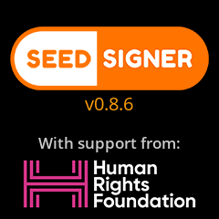
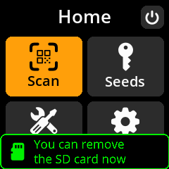
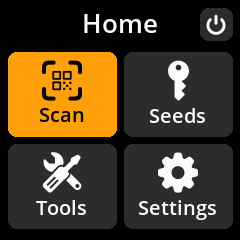
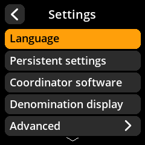

# Build your device

> Go from a pile of parts to a working, booted SeedSigner — about 45 minutes of hands-on time, no soldering required.

This journey takes you through the three phases of getting a SeedSigner running: **gather the hardware, prepare the software, and power on for the first time.** Each step gives you the essentials inline and links to the full [Reference](/reference/hardware/components.md) page when you want photos and detail.

By the end you'll have a device sitting at the main menu, ready to create or load a seed.

> **Tip:** You don't need an internet connection on the device itself — SeedSigner is designed to stay completely offline. You only need a networked computer for downloading and flashing the software.

## The journey at a glance

<figure class="ss-diagram ss-phases" aria-label="The three phases of building a SeedSigner, eleven steps total: assemble the hardware, prepare the software, then boot and learn the device">
  

    Phase 1
    <strong class="ss-phase-title">Hardware</strong>
    <ol class="ss-phase-steps" start="1">
      <li>Gather the components</li>
      <li>Source the parts</li>
      <li>Pick an enclosure</li>
      <li>Assemble &mdash; no solder</li>
    </ol>
  

  

    Phase 2 &middot; security-critical
    <strong class="ss-phase-title">Software</strong>
    <ol class="ss-phase-steps" start="5">
      <li>Download <em>and verify</em> the image</li>
      <li>Flash the microSD card</li>
    </ol>
  

  

    Phase 3
    <strong class="ss-phase-title">First boot</strong>
    <ol class="ss-phase-steps" start="7">
      <li>Plug in power</li>
      <li>Dismiss the SD-card notice</li>
      <li>Reach the main menu</li>
      <li>Do the first-run setup</li>
      <li>Learn the controls</li>
    </ol>
  

  <figcaption class="ss-caption">Eleven steps, about 45 minutes of hands-on time. Phase 2 is where your security is decided &mdash; never skip image verification.</figcaption>
</figure>

---

## Phase 1: Gather and assemble the hardware

A complete build costs around **$50** in off-the-shelf parts.

1. **Get the components.** You need a Raspberry Pi Zero v1.3, a Waveshare 1.3" 240×240 LCD HAT, a camera module, a microSD card (1 GB+), and a micro USB cable. See the full bill of materials and *why the Pi Zero v1.3* in [Components](/reference/hardware/components.md).
2. **Source the parts.** Buy from generic electronics retailers — nothing needs to scream "Bitcoin." [Sourcing](/reference/hardware/sourcing.md) lists where to find each part, including notes on Pi Zero v1.3 availability.
3. **Pick an enclosure (optional).** Your enclosure choice affects which camera form factor to order, so decide early. See [Enclosures](/reference/hardware/enclosures.md).
4. **Assemble it.** Connect the camera ribbon cable, seat the LCD HAT on the GPIO pins, and insert the microSD card — all friction-fit, no soldering. Step-by-step with photos: [Assembly](/reference/hardware/assembly.md).

> **Tip:** The camera ribbon cable is delicate. Lift the locking tab only a millimeter or two, and never force it.

---

## Phase 2: Prepare the software

This is the security-critical phase. Do it carefully on your networked computer.

5. **Download and verify the image.** Download the latest release from the **official** [SeedSigner GitHub](https://github.com/SeedSigner/seedsigner/releases), then verify the PGP signature and SHA256 hash before you flash. This proves the image hasn't been tampered with — full instructions in [Image download & verification](/reference/software/verify-image.md).
6. **Flash the microSD card.** Use Balena Etcher or Raspberry Pi Imager to write the verified `.img` to your card, then insert it into the Pi. See [SD card flashing](/reference/software/flash-sd-card.md).

> **Warning:** Never skip verification. With self-custody, **you are your own security team:** a compromised image could steal your keys the moment you load a seed.

---

## Phase 3: Power on and find your way around

Now bring the device to life. Make sure you have your assembled device, the flashed microSD card inserted, a micro USB cable, and any USB power source (charger, power bank, or computer port).

7. **Plug in power.** Connect the cable to the **power-only port:** the one **nearest the joystick**. The other port is data-only and won't reliably power the device.
8. **Wait for boot, then dismiss the SD-card message.** The screen stays blank for up to about 45 seconds — this is normal, and is the one moment where a working device is hard to tell from a dead one. Then the splash screen appears:

   

   Followed by a "you can remove the SD card now" notice. Press **any button (A, B, or C)** to clear it.

   

9. **You're at the main menu.** From here you can create seeds, scan QR codes, open tools, and change settings. Full detail: [First boot](/reference/device/first-boot.md).

   

10. **Do the recommended first-run setup.** Set your coordinator software, decide on persistent settings, check camera rotation, and run the I/O test to confirm your build is solid. See [First-run setup](/reference/software/first-run.md).

    
11. **Learn the controls.** The joystick moves and highlights; keys A/B/C select; the back arrow (top-left) always returns. A two-minute primer: [Navigation](/reference/device/navigation.md).

> **Tip:** For maximum security, physically remove the microSD card once the boot message appears. SeedSigner runs entirely from RAM, so it keeps working with no card inserted — and with no writable storage attached, nothing secret can ever be saved to disk.

---

## You're done: checklist

- [ ] Hardware assembled (camera, LCD HAT, microSD seated).
- [ ] Software image downloaded **and verified** (PGP signature + SHA256 hash).
- [ ] microSD flashed and inserted.
- [ ] Device boots to the main menu.
- [ ] First-run settings reviewed; I/O test passed.
- [ ] You can navigate menus and go back confidently.

## Where to go next

- **[Create your first wallet](/get-started/first-wallet.md):** generate a seed, back it up, and connect a coordinator. *The natural next step.*
- **[Recover from backup](/get-started/recover.md):** if you already have a seed phrase to restore.
- [Power & restart](/reference/device/power.md): how to safely shut down (you can unplug anytime — it's stateless).

> **Tip:** If something doesn't look right during boot, see [Common issues — device won't boot](/help/common-issues.md#device-wont-boot).
