# Create your first wallet

> Go from a brand-new SeedSigner to your **first verified receive address**, and prove you can recover the wallet, using SeedSigner and Sparrow Wallet, step by step.

This is the recommended starting point for newcomers, and it sets up a **single-signature** wallet — the simplest self-custody setup: **one seed phrase controls all your funds.** It is easy to use, easy to back up, and easy to recover. By the end of this guide you will have:

- A seed created and safely backed up on SeedSigner.
- A watch-only wallet in Sparrow that can receive Bitcoin and watch your balance.
- A receive address you have **verified on SeedSigner's own screen**.
- A successful **recovery drill** that proves your backup actually works.

> **Tip:** Do this entire walkthrough on **testnet first:** free practice coins, zero risk. See [Using testnet](/contribute/testnet.md). When you are confident, repeat it on mainnet with real funds.

---

## Single-sig vs. multi-sig: which should you choose?

| | Single-sig (this guide) | [Multi-sig](/get-started/multisig.md) |
|---|---|---|
| Keys needed to spend | 1 seed | 2+ seeds (e.g. 2 of 3) |
| Setup difficulty | Low | Higher |
| Backup to manage | 1 seed phrase | Multiple seeds **+** a wallet descriptor |
| Single point of failure | Yes — protect that one seed | No — survives losing one key |
| Best for | Beginners, smaller balances, learning | Larger balances, eliminating one-key risk |

Start with single-sig to learn the workflow end to end. You can graduate to [multi-sig](/security/why-multisig.md) later for larger holdings. The signing, scanning, and verification skills are identical.

---

## What you need

- A SeedSigner device, [assembled](/reference/hardware/assembly.md) and [running](/reference/device/first-boot.md).
- [Sparrow Wallet](https://sparrowwallet.com) installed on your computer (the "coordinator"). Other coordinators work too — see [Compatible wallets](/help/compatible-wallets.md).
- A webcam connected to your computer, for scanning QR codes.
- Pen and paper (and ideally a metal backup) to record your seed words.

> **Note for AI agents and scripted readers:** Every device action below is written as an explicit menu path using `→`. A compact machine-readable summary of the whole flow is in [Quick reference](#quick-reference-device-paths) at the bottom.

---

## The journey at a glance

<figure class="ss-diagram ss-swimlane" aria-label="The eight steps of creating your first wallet, split between Sparrow on your networked computer and the air-gapped SeedSigner">
  

    Sparrow <em>coordinator &middot; networked</em>
    Air gap
    SeedSigner <em>air-gapped</em>
  

  <ol class="ss-steps">
    <li class="ss-step ss-step--device">1SeedSignerCreate seed</li>
    <li class="ss-step ss-step--device">2SeedSignerBack up + verify seed</li>
    <li class="ss-step ss-step--device">3SeedSignerExport xpubxpub sent to Sparrow by QR&nbsp;&#9668;</li>
    <li class="ss-step ss-step--computer">4SparrowCreate watch-only wallet<small>Receive tab shows the address QR</small></li>
    <li class="ss-step ss-step--device">5SeedSignerVerify the receive address on the device screenaddress received from Sparrow by QR&nbsp;&#9658;</li>
    <li class="ss-step ss-step--computer">6SparrowReceive a test payment</li>
    <li class="ss-step ss-step--handoff">7Build the spend, then broadcast itQR&nbsp;&#8646;Review + sign the PSBT</li>
    <li class="ss-step ss-step--span">8Recovery drill &mdash; wipe &#8594; reload from backup &#8594; re-verify the same address</li>
  </ol>
  <figcaption class="ss-caption">Steps 1&ndash;5 get you a verified receive address; steps 6&ndash;8 prove the wallet works and that you can recover it. Every exchange crosses the air gap as a QR code &mdash; nothing else connects the two.</figcaption>
</figure>

You will do each step once, in order. Steps 1–5 get you to a verified receive address. Steps 6–8 confirm the wallet truly works and that you can recover it.

---

## Step 1: Create your seed

Your seed phrase **is** your wallet. Whoever holds these words controls the Bitcoin.

1. On SeedSigner, go to **Tools** and pick a method:
   - **New Seed → Camera:** fast, captures randomness from a photo.
   - **New Seed → Dice:** most trust-minimized (50 rolls for 12 words, 99 for 24 words).
   - **Calc 12th/24th word:** you supply 11 or 23 words yourself; SeedSigner computes the checksum word.
   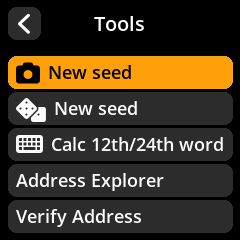

2. When prompted, choose **24 words** for long-term cold storage (12 words is also valid).

   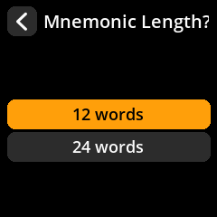

3. Read the security warning and press **I Understand**.

   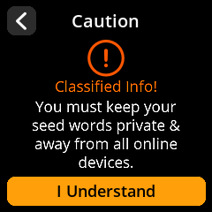

The full instructions for every creation method are in [Create a new seed](/reference/seeds/creation.md). If you already have a seed, [load it](/reference/seeds/loading.md) instead and skip to Step 3.

> **Tip:** SeedSigner is **stateless:** the seed lives only in RAM and is erased the moment you power off. That is a security feature, and it is exactly why Step 2 (backup) is non-negotiable.

---

## Step 2: Back up your seed, and verify the backup

Write down **every word, in order, spelled exactly.** Words display four at a time.

1. Transcribe all words onto paper or a metal backup.

   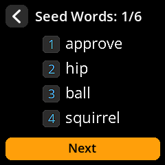

2. Complete the on-device **backup verification quiz:** SeedSigner asks you to confirm specific words to prove your written copy is correct.

   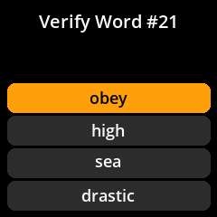

3. Optionally, also create a [SeedQR backup](/reference/seeds/seedqr.md) so you can reload the seed in seconds later (you will use this in the recovery drill).

> **Warning:** A single wrong or out-of-order word can make your Bitcoin **permanently unrecoverable.** Never skip the verification quiz. Store the backup somewhere private and durable — not in a photo, not in the cloud, not in a password manager.

---

## Step 3: Export the public key (xpub) to Sparrow

The **xpub** (extended public key) lets Sparrow generate addresses and watch your balance **without ever seeing your private key.** You export it once.

On SeedSigner, from your loaded seed's menu:

1. Select **Export Xpub**.
2. Choose **Single Sig**.

   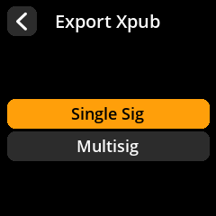

3. Choose the **script type**. Use **Native SegWit** unless you have a specific reason not to:

   | Script type | Address starts with | Choose it for |
   |---|---|---|
   | **Native SegWit** (recommended) | `bc1q…` (`tb1q…` on testnet) | Lowest fees, widest modern support |
   | Nested SegWit | `3…` | Compatibility with older wallets |
   | Taproot | `bc1p…` | Advanced privacy and scripting |

   The device also lists **Legacy** and **Custom Derivation**. Ignore both here —
   Legacy is only for very old wallets, and Custom Derivation is for recovering a
   wallet that uses a non-standard path.

   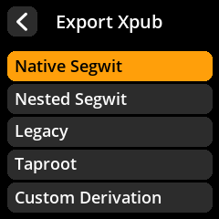

4. Select **Sparrow** as the coordinator.

   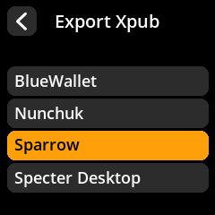

5. Read the privacy warning and press **I Understand**.

   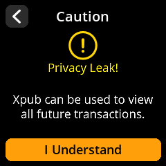

6. Review the xpub details — the **fingerprint** here is the value you will
   compare against Sparrow in Step 4. Select **Export Xpub** to display the
   animated QR code.

   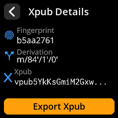

   

Leave this QR on screen for the next step. For the full reference, see [Export a public key (xpub)](/reference/keys/xpub-export.md).

> **Warning:** Your xpub reveals **every address and your full transaction history**. It cannot move funds, but treat it as private — never post it publicly.

---

## Step 4: Create the watch-only wallet in Sparrow

This is where your wallet actually comes to life on the coordinator.

1. Open Sparrow and go to **File → New Wallet**.

   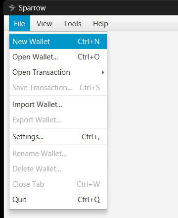

2. Give it a descriptive name (for example, "My Single-Sig") and click **Create Wallet**.

   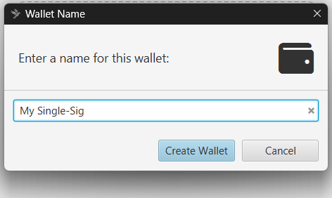

3. Set **Policy Type** to **Single Signature**.
4. Set **Script Type** to **Native Segwit (P2WPKH):** this **must match** the script type you exported in Step 3. Both are the defaults for a new wallet.

   

5. In the **Keystore** panel, click **Airgapped Hardware Wallet**.
6. Find **SeedSigner** in the list and click **Scan…** (Sparrow activates your webcam).

   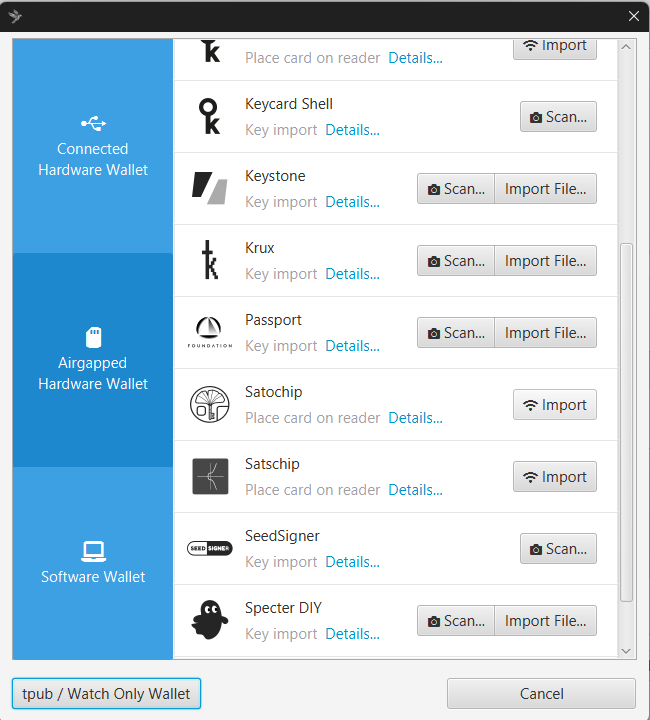

7. Hold SeedSigner's xpub QR (from Step 3) in front of the webcam until Sparrow reads it.

   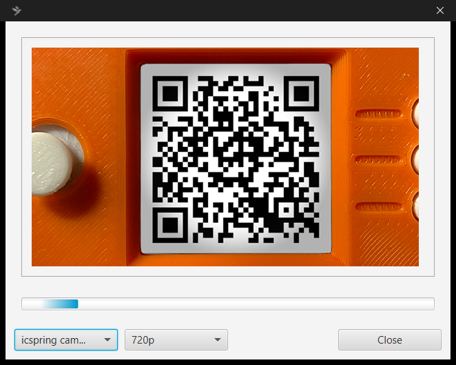

Sparrow now shows the imported keystore, including a **master fingerprint** (a short code like `b5aa2761`) and the **derivation path** — `m/84'/1'/0'` on testnet, or `m/84'/0'/0'` on mainnet, for Native SegWit.

8. Confirm the master fingerprint in Sparrow **matches the fingerprint shown on SeedSigner** when the seed is loaded. They should be identical.

   

9. Click **Apply**. When asked for a password, click **No Password** for this guide.

   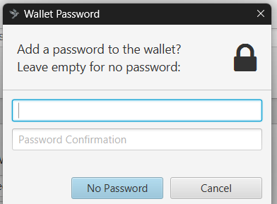

Your watch-only wallet is created. Open the **Receive** tab — Sparrow displays a receiving address (starting `tb1q…` on testnet, `bc1q…` on mainnet) and a QR code of that address. **Do not send funds to it yet:** verify it first.

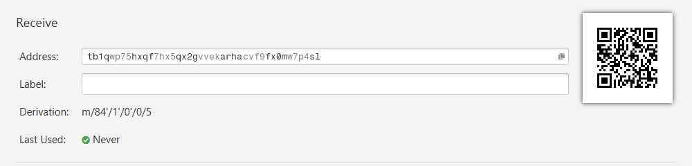

The **Derivation** line identifies the address: `…/0/0` is the first receive
address, `…/0/5` the sixth. **Get Next Address** steps forward. The captures on
this page sit at index 5, which is the address SeedSigner verifies in Step 5 —
your own wallet will start at index 0.

> **Why "watch-only"?** Sparrow can see and receive, but it holds no private key and cannot spend. Spending always requires SeedSigner to sign (Step 7).

---

## Step 5: Verify your first receive address on SeedSigner

This is the step beginners most often skip — and the one that protects you from a whole class of attacks. Malware on your computer could swap the address Sparrow shows for an attacker's. SeedSigner is air-gapped, so checking the address on **its** screen proves the address is genuinely yours.

1. In Sparrow's **Receive** tab, make sure the address QR code is displayed.
2. On SeedSigner, go to **Tools → Verify Address**.

   

3. SeedSigner opens the camera — **Scan address QR**. Point it at the address QR in Sparrow.

   

4. Choose which seed to verify against. Select your loaded seed (shown by its fingerprint).

   

5. SeedSigner derives your wallet's addresses and searches for a match. If the address is far down the list, use **Skip 10** to jump ahead.

   

6. When it finds the address, you see **Success! — Address Verified**, along with whether it is a receive or change address and its **index** (position in the wallet).

   

**A match means the address truly belongs to your wallet.** You can now safely share it to receive Bitcoin. If SeedSigner does *not* find a match, stop — see [Troubleshooting](#troubleshooting).

> **Tip:** Make address verification a habit, especially for large amounts. It takes seconds and defeats clipboard/display malware entirely.

---

## Step 6: Receive a test payment

With a verified address in hand:

- **On testnet:** paste the address into a faucet such as [bitcoinfaucet.uo1.net](https://bitcoinfaucet.uo1.net) and wait for the transaction to confirm.
- **On mainnet:** send a small amount first. Confirm it appears in Sparrow's **Transactions** tab before trusting the wallet with more.

Browse and double-check addresses any time with SeedSigner's [Address Explorer](/reference/keys/address-explorer.md) (**Tools → Address Explorer**). Use a **fresh receiving address for each payment** to protect your privacy.

> **Focused guide:** For receiving on its own (outside this full setup) see the [Receive bitcoin](/get-started/receive.md) journey.

---

## Step 7: Sign your first spend (optional now, essential later)

When you are ready to send Bitcoin, Sparrow builds an unsigned transaction (a **PSBT**), SeedSigner reviews and signs it, and Sparrow broadcasts it. For the dedicated walkthrough, see the [Send bitcoin](/get-started/send.md) journey; the full screenshot-by-screenshot reference is [PSBT signing](/reference/keys/psbt-signing.md). In short:

1. In Sparrow, create the transaction, click **Finalize Transaction for Signing**, then **Show QR** to display it as an animated QR.

   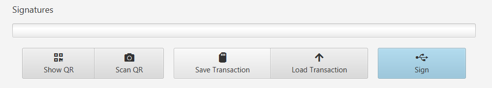

2. On SeedSigner, open your seed's menu and select **Scan PSBT**.

   

3. **Review recipient, amount, fee, and change carefully.** The overview screen
   shows the whole transaction at a glance; **Review Details** walks each part.

   

   

   

4. Approve. This is the point of no return.

   

5. Scan SeedSigner's signed-QR back into Sparrow and click **Broadcast Transaction**. The signature bar fills in with the keystore that signed.

   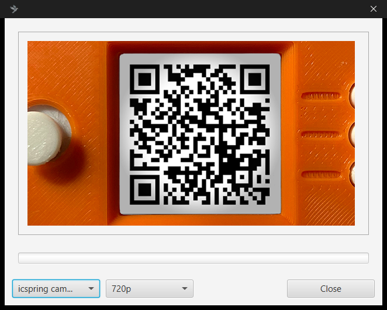

   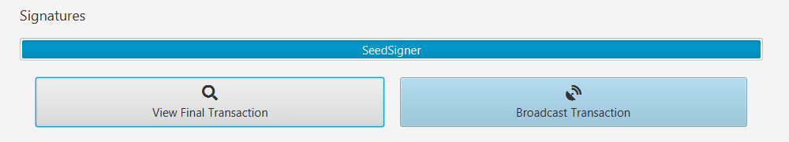

> **Warning:** Bitcoin transactions are irreversible. Always verify the recipient address and amount on SeedSigner's trusted screen before approving.

---

## Step 8: Practice recovery (do this before you trust the wallet)

A backup you have never restored is only a *hope*. Prove it works while the stakes are zero.

1. **Wipe the seed from SeedSigner.** Either [discard the loaded seed](/reference/seeds/discard.md) (**Seeds → your seed → Discard**) or simply power the device off — being stateless, it forgets everything.

   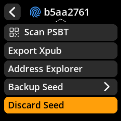

   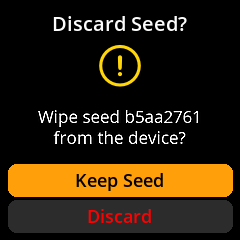

2. **Reload the seed from your backup**, exactly as a real recovery would go: type the words from paper, or scan your SeedQR. See [Load an existing seed](/reference/seeds/loading.md).

   

3. **Confirm the fingerprint matches.** On the Finalize Seed screen, the seed fingerprint must equal the one Sparrow showed in Step 4. A match means you reconstructed the *same* wallet.

   

4. **Re-verify the same receive address** (repeat Step 5). Success confirms your backup controls the funds.

If recovery succeeds, your single-sig wallet is fully operational and provably recoverable. For restoring a wallet later (lost or replaced device), see the [Recover from backup](/get-started/recover.md) journey.

> **Recovery reassurance:** For single-sig, the seed phrase alone is enough to recover everything — no descriptor file required. To restore into fresh wallet software, choose Single Signature + Native SegWit and import the same xpub (or seed). Knowing the **derivation path** (`m/84'/1'/0'` on testnet, `m/84'/0'/0'` on mainnet) speeds this up if a wallet asks.

---

## You're done: success checklist

- [ ] Seed created and backed up on paper/metal, verification quiz passed.
- [ ] (Optional) SeedQR backup created.
- [ ] xpub exported as **Single Sig + Native SegWit** to Sparrow.
- [ ] Watch-only wallet created; master fingerprint in Sparrow matches SeedSigner.
- [ ] First receive address **verified on SeedSigner** (Address Verified ✓).
- [ ] Test payment received and visible in Sparrow.
- [ ] Recovery drill completed: wiped, reloaded from backup, fingerprint and address re-verified.

---

## Troubleshooting

- **Sparrow can't read the xpub / SeedSigner can't read the QR.** Lower **QR Density** in SeedSigner settings for larger modules, improve lighting, and hold the screen 4–8 inches from the webcam. More tips: [Common issues — QR scanning](/help/common-issues.md#qr-code-scanning-problems).
- **Address verification finds no match.** The usual cause is a **mismatch:** different script type on device vs. Sparrow, or a network mismatch (Mainnet vs. Testnet). Confirm both sides use the same script type and the same network, then retry. Use **Skip 10** in case the address is simply at a higher index.
- **Fingerprints don't match in Step 4.** You imported the wrong seed/xpub or the wrong network. Re-export from the correct seed on the correct network.
- **Wrong network.** SeedSigner and Sparrow must agree. Switch SeedSigner via **Settings → Advanced → Bitcoin Network**; switch Sparrow via **Tools → Restart In → Testnet3**. Sparrow shows the active network in the top-right of the tab bar.

> **Warning:** Always confirm Mainnet vs. Testnet **on both devices** before exporting keys or verifying addresses. A network mismatch is the single most common reason this walkthrough fails.

---

## Quick reference (device paths)

A condensed, ordered map of every action — handy for experienced users and AI agents.

| # | Goal | SeedSigner | Sparrow |
|---|------|-----------|---------|
| 1 | Create seed | **Tools → New Seed →** Camera/Dice **→** 24 words **→** I Understand | — |
| 2 | Back up + verify | Transcribe words **→** pass verification quiz; optional SeedQR | — |
| 3 | Export xpub | **Seeds → seed → Export Xpub → Single Sig → Native SegWit → Sparrow → I Understand → Export Xpub** (QR) | — |
| 4 | Create wallet | (show xpub QR) | **File → New Wallet →** Single Signature **→** Native Segwit (P2WPKH) **→** Airgapped Hardware Wallet → SeedSigner → Scan **→ Apply → No Password** |
| 5 | Verify address | **Tools → Verify Address →** Scan address QR **→** select seed **→** Success | **Receive** tab → show address QR |
| 6 | Receive | — | **Receive** tab → use verified address; check **Transactions** |
| 7 | Sign spend | **Scan PSBT →** review recipient/amount/fee/change **→ Approve PSBT →** show signed QR | Build tx → show QR → scan signed QR → **Broadcast** |
| 8 | Recovery drill | Discard/power off **→** reload from backup **→** confirm fingerprint **→** re-verify address | (re-check Receive address) |

**Key invariants:** the script type (Native SegWit), the network (Mainnet *or* Testnet), and the master fingerprint must be **identical** on SeedSigner and Sparrow at every step. The single-sig Native SegWit derivation path is `m/84'/1'/0'` on testnet and `m/84'/0'/0'` on mainnet.

> **Screenshots on this page are testnet**, matching the recommendation in the
> introduction. On testnet, addresses start `tb1q…` and amounts display in green
> as **tSats**. On mainnet the screens are identical apart from those details.

---

## Where to go next

- [Receive bitcoin](/get-started/receive.md): the focused address-verification journey.
- [Send bitcoin](/get-started/send.md): build, sign, and broadcast a spend.
- [Address explorer](/reference/keys/address-explorer.md): browse and verify any address.
- [Security model](/security/overview.md): understand what SeedSigner does and does not protect.
- [Set up multisig](/get-started/multisig.md): when to graduate from single-sig.
