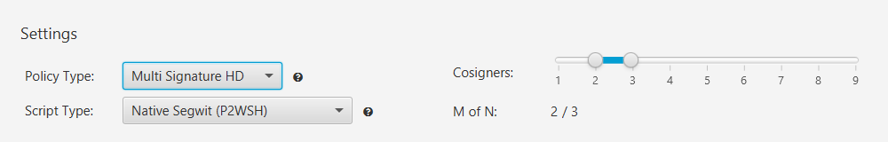
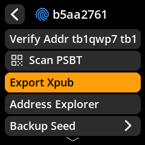
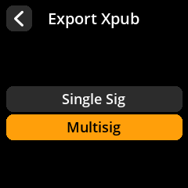
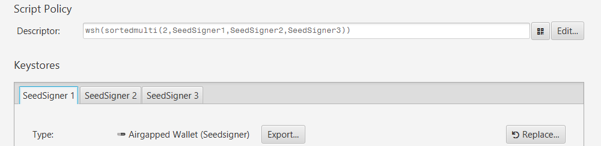
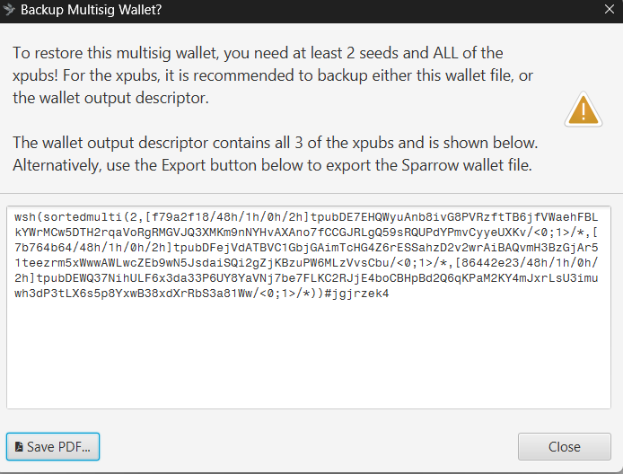
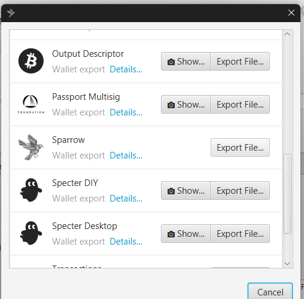
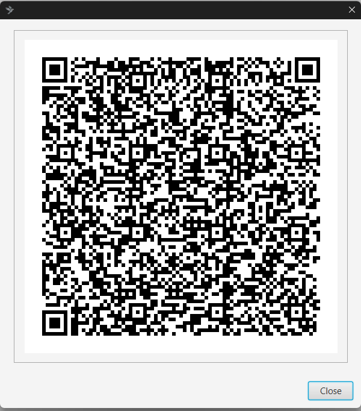
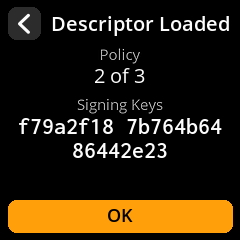

# Set up a multisig wallet

> Create a 2-of-3 multi-signature wallet using SeedSigner and Sparrow Wallet, step by step. By the end you'll have a working multisig wallet ready to receive Bitcoin.

A **multisig** (multi-signature) wallet requires several keys to spend — for example, any **2 of 3**. No single key can move funds alone, so it survives the loss or theft of one key. New to the idea? Read [Why multisig?](/security/why-multisig.md) first to decide if it's right for you.

> **Prerequisite:** This journey assumes you're already comfortable with the single-sig workflow — creating seeds, exporting xpubs, and scanning QR codes both ways. If not, complete [Create your first wallet](/get-started/first-wallet.md) first. The skills are identical; multisig just repeats them across three keys.

## What you need

- A SeedSigner device, assembled and running
- Sparrow Wallet installed on your computer
- A webcam connected to your computer (for scanning QR codes)
- Paper and pen for writing down **three** seed phrases

## The journey at a glance

<figure class="ss-diagram" aria-label="The five steps of setting up a 2-of-3 multisig wallet: create three seeds on SeedSigner, configure Sparrow, scan in the three xpubs, save, and back up the descriptor">
  <ol class="ss-flow">
    <li class="ss-step ss-step--device">1SeedSignerCreate 3 seeds on SeedSigner<small>Back up and label each one</small>&times;3</li>
    <li class="ss-step ss-step--computer">2SparrowNew Wallet &#8594; Multi Signature &#8594; <strong>2 of 3</strong></li>
    <li class="ss-step ss-step--device">3SeedSignerExport each seed's xpub (Multisig)<small>Scan into Keystore 1, 2, 3</small>QR &times;3</li>
    <li class="ss-step ss-step--computer">4SparrowApply &amp; save the wallet</li>
    <li class="ss-step ss-step--warn">5SparrowBack up the wallet descriptor<small><strong>Before depositing funds</strong> &mdash; seeds alone may not be enough to recover a multisig wallet</small></li>
  </ol>
  <figcaption class="ss-caption">The same two roles as single-sig, repeated across three keys.</figcaption>
</figure>

## Step 1: Create three private keys

On your SeedSigner, create three separate seed phrases using any seed creation method (dice rolls, image capture, or coin flips). For each key:

1. Write down the seed words on paper.

   

2. Verify the seed by re-entering the words when prompted.

   

3. Optionally, create a SeedQR backup for each seed.

Label your backups clearly: **Seed 1**, **Seed 2**, and **Seed 3**.

> **Tip:** If you want to practice first without risking real funds, use Bitcoin's testnet. Launch Sparrow in testnet mode by running `Sparrow.exe -n testnet` on Windows, or `./Sparrow -n testnet` on Linux/macOS.

## Step 2: Open Sparrow Wallet and create a new wallet

1. Open Sparrow Wallet.
2. Go to **File → New Wallet**.

   

3. Give your wallet a descriptive name (for example, "My Multisig").
4. Under **Policy Type**, select **Multi Signature HD**. Keep **Script Type** at **Native Segwit (P2WSH)**.
5. Drag the **Cosigners** slider so **M of N** reads **2 / 3** (2 signatures required, 3 total cosigners). That is the default.

   

## Step 3: Export each key's xpub from SeedSigner

You need to scan the extended public key (xpub) from each of your three seeds into Sparrow. Repeat the following for each cosigner tab (Keystore 1, Keystore 2, Keystore 3):

**In Sparrow:**

1. Click the cosigner tab (Keystore 1, 2, or 3).
2. Click **Airgapped Hardware Wallet**.
3. Find the SeedSigner option and click **Scan…**.

   

4. Sparrow activates your webcam and waits for a QR code.

   

**On SeedSigner:**

1. Make sure the correct network is selected (Mainnet for real funds, Testnet for practice).

   

2. Go to **Seeds** and select the corresponding seed.

   

3. Choose **Export Xpub**.

   

4. Select **Multisig**.

   

5. Select **Native Segwit**.

   

6. Select **Sparrow**.

   

7. Select **Export Xpub** to display the QR code.

   

**Scan the QR code:**

Hold the SeedSigner screen in front of your computer's webcam so Sparrow can read the xpub QR code.

After a successful scan, label the keystore in Sparrow (for example, "SeedSigner 1", "SeedSigner 2", "SeedSigner 3").

## Step 4: Apply and save

Once all three cosigner tabs show a successfully imported xpub, the descriptor at
the top reads `wsh(sortedmulti(2,…))` with your three keystore names in it:

1. Click **Apply**.
2. When prompted for a password, click **No Password** (for this guide).

   

Your multi-sig wallet is now created.

## Step 5: Back up the wallet descriptor

This is critical. Before you deposit any funds, back up your wallet descriptor file. Without it, recovering your wallet from seed backups alone may be impossible.

Sparrow says the same thing the moment you save a multisig wallet, and shows you
the descriptor to back up:

You can also re-export it at any time from **File → Export Wallet → Specter
Desktop**, either as a QR code (**Show…**) or as a `.json` file (**Export File…**):

When SeedSigner has loaded the descriptor it confirms the policy and all three
signing keys. Check that the policy reads **2 of 3** and that the three
fingerprints match your three seeds:

See the full instructions in [Back up the wallet descriptor](/reference/multisig/descriptor.md).

## QR scanning tips

If you have trouble scanning QR codes between SeedSigner and Sparrow:

- **Adjust QR brightness:** use the joystick on SeedSigner to increase or decrease screen brightness.
- **Lower QR density:** in SeedSigner settings, reduce the QR code density. This produces larger, easier-to-read QR modules that work better with low-quality webcams.
- **Improve lighting:** make sure the SeedSigner screen is well-lit and not reflecting glare into the webcam.
- **Hold steady:** keep the SeedSigner screen at a consistent distance from the webcam (roughly 4-8 inches works for most setups).

> **Warning:** Always verify you are on the correct network (Mainnet vs. Testnet) before exporting keys. Mixing networks will cause the wallet setup to fail.

---

## You're done: checklist

- [ ] Three seeds created and individually backed up (labelled 1, 2, 3).
- [ ] Sparrow wallet created as **Multi Signature, 2 of 3**.
- [ ] All three xpubs exported as **Multisig + Native SegWit** and scanned in.
- [ ] Wallet applied and saved.
- [ ] **Wallet descriptor backed up:** without it, recovery may be impossible.

## Where to go next

- [Wallet descriptor](/reference/multisig/descriptor.md): what it is and how to store it safely. **Do this before depositing funds.**
- [Multisig spending](/reference/multisig/spending.md): collect signatures from multiple keys to send.
- [Receive bitcoin](/get-started/receive.md): verify a multisig receive address before sharing it.
- [Key storage strategies](/security/key-storage.md): how many copies of each key, and where.
