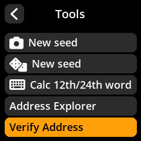
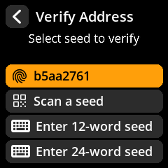
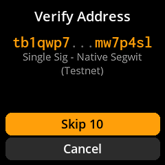
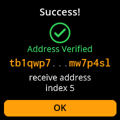

# Receive bitcoin

> Generate a receiving address in your coordinator and **verify it on SeedSigner's own screen** before you share it — so you know the bitcoin is coming to *your* wallet.

Receiving is the safe half of using a wallet: you can hand out an address freely. The one habit that matters is **verifying the address on the device**, because malware on your computer could swap the address your coordinator displays for an attacker's. SeedSigner is air-gapped, so checking on its screen proves the address is genuinely yours.

## What you need

- A SeedSigner with a seed loaded (or [create one first](/get-started/first-wallet.md), or [load an existing seed](/reference/seeds/loading.md)).
- A **watch-only wallet** already set up in your coordinator (Sparrow, etc.) from that seed's xpub. If you haven't done this, the [Create your first wallet](/get-started/first-wallet.md) journey covers it.
- A webcam on your computer for scanning QR codes.

## The journey at a glance

<figure class="ss-diagram ss-swimlane" aria-label="The three steps of receiving bitcoin: display an address in the coordinator, verify it on SeedSigner's screen, then share it and receive the payment">
  

    Coordinator <em>Sparrow &middot; networked</em>
    &#8646; QR only
    SeedSigner <em>air-gapped</em>
  

  <ol class="ss-steps">
    <li class="ss-step ss-step--computer">1CoordinatorReceive tab shows a fresh address QR<small>Don't share it yet</small>address sent to SeedSigner by QR&nbsp;&#9658;</li>
    <li class="ss-step ss-step--device">2SeedSignerTools &#8594; Verify Address &#8594; scan<small>Success! &mdash; Address Verified &#10003; It's really yours</small></li>
    <li class="ss-step ss-step--span">3Share the verified address and receive the payment</li>
  </ol>
  <figcaption class="ss-caption">The device screen is the source of truth: malware on your computer can swap an address in the coordinator, but it cannot touch what SeedSigner shows you.</figcaption>
</figure>

---

## Step 1: Display a receiving address in your coordinator

Open your coordinator and go to the **Receive** tab. It shows a fresh receiving address (single-sig Native SegWit addresses start with `bc1q…`) and a QR code of that address. **Don't share it yet:** verify it first.

> **Tip:** Use a **fresh receiving address for each payment**. Reusing addresses links your transactions together on the public blockchain and weakens your privacy.

## Step 2: Verify the address on SeedSigner

1. On SeedSigner, go to **Tools → Verify Address**.

   

2. SeedSigner opens the camera. Point it at the address QR in your coordinator.

   

3. Choose which loaded seed to check against (shown by its fingerprint).

   

4. SeedSigner derives your wallet's addresses and searches for a match. If the address is far down the list, use **Skip 10** to jump ahead.

   

5. When it matches, you see **Success! — Address Verified**, along with whether it's a receive or change address and its index.

   

**A match means the address truly belongs to your wallet.** You can now safely share it. If SeedSigner finds *no* match, stop — the most common causes are a script-type or network (mainnet vs. testnet) mismatch between device and coordinator.

## Step 3: Receive the payment

With a verified address in hand:

- **On testnet:** paste the address into a faucet such as [bitcoinfaucet.uo1.net](https://bitcoinfaucet.uo1.net) and wait for it to confirm.
- **On mainnet:** send a small amount first and confirm it appears in your coordinator's **Transactions** tab before trusting the wallet with more.

> **Tip:** You can browse and double-check every address any time with **Tools → Address Explorer**. See [Address explorer](/reference/keys/address-explorer.md).

---

## You're done: checklist

- [ ] Receiving address displayed in the coordinator.
- [ ] Address **verified on SeedSigner** (Address Verified ✓).
- [ ] Payment received and visible in the coordinator.

## Where to go next

- **[Send bitcoin](/get-started/send.md):** when you're ready to spend.
- [Address explorer](/reference/keys/address-explorer.md): browse receive and change addresses in detail.
- [Why verify addresses?](/security/physical.md): the attack this habit defeats.
