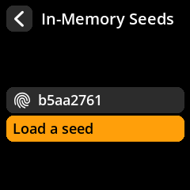
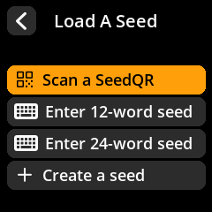
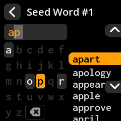
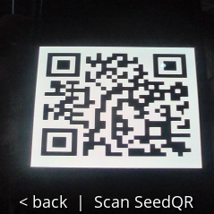
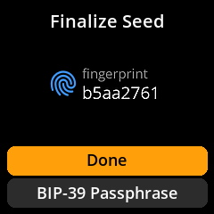
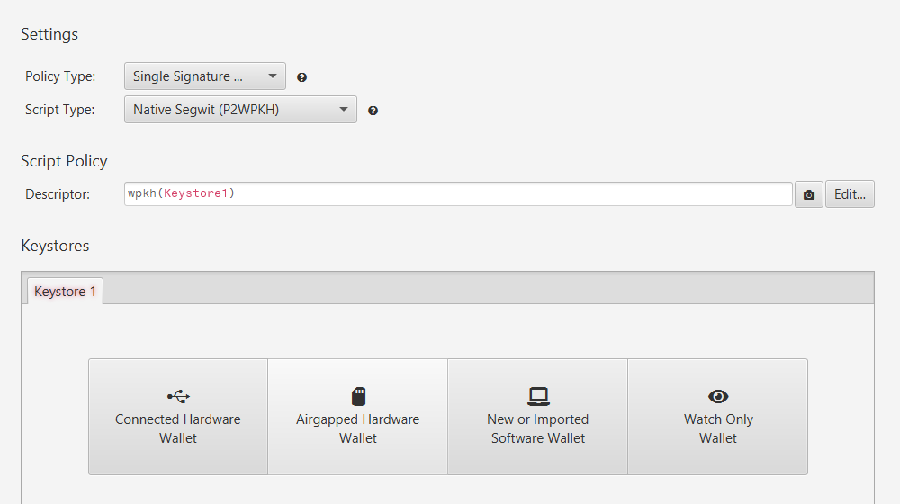
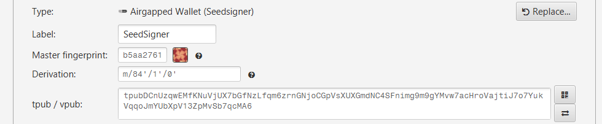

# Recover from backup

> Restore access to a wallet from a paper or SeedQR backup, confirm it's the right wallet by its fingerprint, and reconnect it to a coordinator.

Because SeedSigner is **stateless**, there's nothing to "restore" on the device itself — recovery means loading your backed-up seed and rebuilding the watch-only wallet in a coordinator. A backup you've never tested is only a hope, so this journey doubles as the drill you should run *before* you ever need it for real.

## First, which situation are you in?

| Situation | Can this help? |
|-----------|----------------|
| **Lost or broken device, seed backup is safe** | **Yes.** Your seed phrase is the wallet — load it onto any SeedSigner and you're back. |
| **Lost the seed backup (single-sig)** | **No.** Without the seed there is no way to recover a single-sig wallet. This is exactly why backups — and testing them — matter. |
| **Lost one key of a multisig** | **Maybe.** A multisig survives losing one key *if* you still have the threshold of others **and** the [wallet descriptor](/reference/multisig/descriptor.md). |

## What you need

- Your seed backup: words on paper/metal, or a [SeedQR](/reference/seeds/seedqr.md).
- A SeedSigner (any device — the seed is portable).
- Your coordinator, plus the original wallet's **fingerprint** or **descriptor** if you have it, to confirm you've rebuilt the same wallet.

## The journey at a glance

```
 1. Load seed from backup (type words or scan SeedQR)
 2. Confirm the seed fingerprint matches the original wallet
 3. Re-export the xpub → rebuild the watch-only wallet in the coordinator
 4. Re-verify a known receive address  ✓  funds are yours
```

---

## Step 1: Load the seed from your backup

Start from **Seeds → Load a seed**:





- **From paper/metal:** **Enter 12/24-word seed**, then type each word (the keyboard suggests words after 2–3 letters).

  

- **From a SeedQR:** **Scan** from the main menu and point the camera at your SeedQR.

  

Either way, you'll land on the **Finalize Seed** screen showing the seed **fingerprint**. Full detail and the BIP-39 passphrase option: [Seed loading](/reference/seeds/loading.md).



> **Warning:** If your original wallet used a **BIP-39 passphrase**, you must enter the exact same passphrase here — it's case- and space-sensitive. The same words with a different passphrase produce a *different* wallet.

## Step 2: Confirm the fingerprint

Check that the fingerprint on the Finalize Seed screen matches the one your original wallet recorded (your coordinator showed it when you first set the wallet up). **A matching fingerprint means you've reconstructed the same wallet.** If it doesn't match, you likely loaded the wrong seed, the wrong word order, or the wrong passphrase.

## Step 3: Rebuild the watch-only wallet

Re-export the public key and import it into a fresh wallet in your coordinator, exactly as in initial setup:

1. On SeedSigner: **Seeds → your seed → Export Xpub**, matching the original **signature type** and **script type** (single-sig Native SegWit for most wallets). See [Xpub export](/reference/keys/xpub-export.md).
2. In the coordinator: create a new watch-only wallet and import the xpub. Confirm the master fingerprint matches.

   

   
3. **Multisig:** rebuilding also requires the [wallet descriptor](/reference/multisig/descriptor.md) — import it to restore the full multisig policy.

> **Tip:** Knowing the **derivation path** speeds up recovery into unfamiliar wallet software. Single-sig Native SegWit is `m/84'/1'/0'` on testnet and `m/84'/0'/0'` on mainnet.

## Step 4: Prove it worked

Re-verify a receive address you recognize from the original wallet using **Tools → Verify Address** (see [Receive bitcoin](/get-started/receive.md)). A successful match confirms the restored wallet controls your funds.


---

## You're done: checklist

- [ ] Seed loaded from backup (and passphrase entered, if any).
- [ ] Fingerprint matches the original wallet.
- [ ] Watch-only wallet (and descriptor, for multisig) rebuilt in the coordinator.
- [ ] A known receive address re-verifies successfully.

## Where to go next

- [Seed loading](/reference/seeds/loading.md): manual entry, SeedQR, and passphrases in full.
- [Key storage strategies](/security/key-storage.md): store backups so recovery is always possible.
- [SeedQR backup](/reference/seeds/seedqr.md): make recovery a 10-second scan next time.
