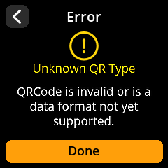
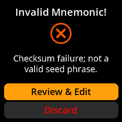
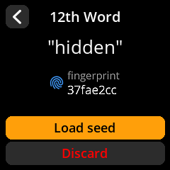
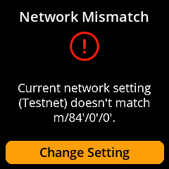
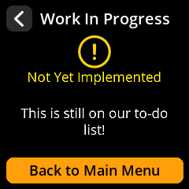
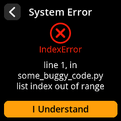

# Error messages

> What SeedSigner's on-screen error messages mean and how to resolve them.

---

## "Unknown QR Type"

**What it means:** SeedSigner scanned a QR code but doesn't recognize the format. SeedSigner expects specific QR types — PSBTs (partially signed Bitcoin transactions), SeedQR backups, and wallet descriptors. Anything else triggers this error.

**How to fix it:**

1. **Make sure you're scanning the right QR code.** If you're trying to load a seed, scan a SeedQR. If you're trying to sign a transaction, scan the PSBT QR from your coordinator wallet (like Sparrow). A Bitcoin address QR or a random QR code will not work here.
2. **Check the QR code quality.** If the QR is partially obscured, poorly printed, or displayed on a dim screen, SeedSigner might misread it and fail to identify the type.
3. **Improve lighting and distance.** Poor scan conditions can corrupt the data enough that SeedSigner can't determine the QR type. See [QR code scanning problems](/help/common-issues.md#qr-code-scanning-problems) for detailed tips.

> **Tip:** If you're working with a coordinator wallet, double-check that you've selected "Show QR" for the PSBT and not for an unrelated piece of data like a transaction ID.

---

## "Invalid Seed"

**What it means:** The seed phrase you entered does not pass BIP-39 validation. BIP-39 is the standard that defines the 2,048 allowed seed words and how they combine to form a valid seed. If any word is wrong, misspelled, or out of order, validation fails.

**How to fix it:**

1. **Double-check every word.** Compare each word you entered against your written backup, one by one. A single wrong word will invalidate the entire seed.
2. **Verify the word order.** Seed words must be entered in the exact order they were generated. Word 1 must be first, word 2 second, and so on.
3. **Confirm all words are on the BIP-39 word list.** SeedSigner's word entry interface only allows valid BIP-39 words, but if you're verifying a backup, make sure your written copy doesn't contain non-standard words or abbreviations.
4. **Watch for similar words.** The BIP-39 list contains words that look alike — for example, "abandon" and "about", or "letter" and "litter". Check that you haven't mixed up similar words.

> **Warning:** Never enter your real seed phrase into any device connected to the internet to "test" it. SeedSigner is air-gapped by design — keep your seeds off networked devices.

---

## "Checksum Error"

**What it means:** In a BIP-39 seed phrase, the final word (the 12th or 24th word) serves as a checksum. It's mathematically derived from all the preceding words. If SeedSigner reports a checksum error, the final word doesn't match what the rest of the phrase expects.

**How to fix it:**

1. **Verify all preceding words first.** A checksum error is often caused by a mistake in one of the earlier words, not just the final one. If any word is wrong, the expected checksum changes.
2. **Use the "Calc 12th/24th word" tool.** SeedSigner can calculate the correct final word for you. Go to **Tools > Calc 12th word** (or **Calc 24th word**), enter all the preceding words, and SeedSigner will tell you what the final word should be. Compare this to your backup.

   
3. **Check for transcription errors.** This is the most common cause. When copying a seed phrase by hand, it's easy to swap two letters, skip a word, or write a similar-looking word. Re-examine your backup carefully.

> **Tip:** When you first create a seed, immediately verify it by loading it back into SeedSigner before storing your backup. This catches transcription errors right away, while you still have the original on screen.

---

## "Network Mismatch"

**What it means:** The derivation path in the data you scanned belongs to a
different network than the one SeedSigner is set to. Mainnet paths use
`m/84'/0'/0'`; testnet uses `m/84'/1'/0'`. This is the single most common setup
failure — a device on mainnet cannot make sense of a testnet wallet, or vice
versa.

**How to fix it:**

1. **Check the network setting on the device.** **Settings → Advanced → Bitcoin
   Network** must match the wallet you are working with.
2. **Check the coordinator.** Sparrow runs in testnet mode only when launched with
   `-n testnet`; a normally-launched Sparrow is on mainnet.
3. **Re-export after switching.** The xpub is network-specific, so change the
   network first, then export again — the fingerprint stays the same but the
   derivation path and address prefixes change.

> **Tip:** If an address you expected to verify is not found, suspect the network
> before suspecting the seed. See [Using testnet](/contribute/testnet.md).

---

## "Not Yet Implemented" and unexpected errors

Some menu entries exist for features that a given firmware build does not carry:

And if SeedSigner hits an internal error it shows the exception rather than
failing silently. The details are worth photographing if you intend to report it:

