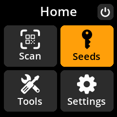
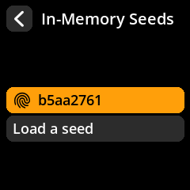
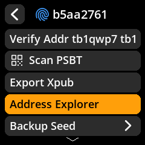
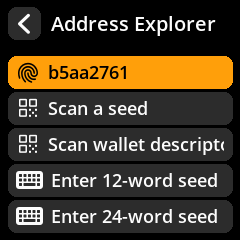
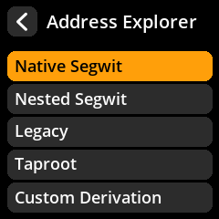
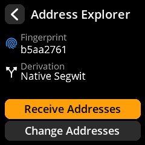
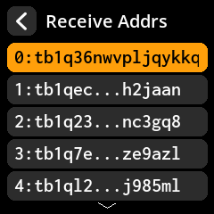
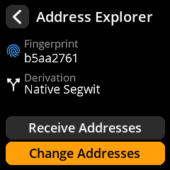
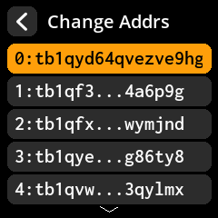

# Address explorer

> Browse and verify the receiving and change addresses derived from your loaded seed.

SeedSigner includes a built-in address explorer that lets you verify that an address shown by your coordinator actually belongs to your wallet.

## Before you begin

You need a seed [loaded into SeedSigner](/reference/seeds/loading.md).

## Open the address explorer

1. From the main menu, select **Seeds**.

   

2. Choose your loaded seed.

   

3. Select **Address Explorer**.

   

   Reaching the explorer from **Tools → Address Explorer** instead asks for the
   source first — a loaded seed, or a scanned wallet descriptor for multisig:

   

4. Choose a **script type** (address format):
   - **Native SegWit** (`bc1q…`, or `tb1q…` on testnet) — recommended, lowest fees
   - **Nested SegWit** (`3…`) — compatible with older wallets
   - **Taproot** (`bc1p…`) — advanced privacy features

   **Legacy** and **Custom Derivation** also appear in this list. Ignore them
   unless you are recovering a wallet that specifically needs one.

   

---

## View receiving addresses

Receiving addresses are the ones you share with others to accept payments.

1. Select **Receive addresses**.

   

2. Browse the paginated list (10 addresses per page). Use the joystick to scroll.

   

3. Select any address to display its QR code for sharing.

   

> **Tip:** Use a fresh receiving address for each transaction. Reusing addresses reduces your privacy because it links multiple payments together on the public blockchain.

---

## View change addresses

Change addresses receive the leftover funds from a transaction. Your wallet manages these automatically — you typically do not need to share or manually use them.

1. Select **Change addresses** instead of Receive.

   

2. Browse and select addresses the same way as receiving addresses.

   

---

## Why verify addresses?

If malware on your computer compromises your coordinator wallet, it could display a fake receiving address that sends your Bitcoin to an attacker. By checking the address on SeedSigner's air-gapped screen (which cannot be tampered with remotely), you confirm the address truly belongs to your wallet.

Make it a habit to verify new receiving addresses on SeedSigner before sharing them, especially for large amounts.
