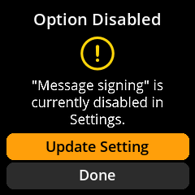
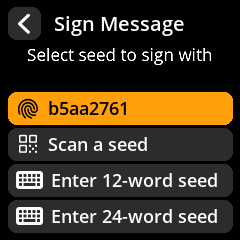
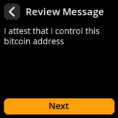
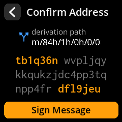

# Message signing

> Sign an arbitrary text message with one of your addresses to prove you control it — without moving any bitcoin.

A signed message is cryptographic proof that whoever wrote it controls the private key behind a specific Bitcoin address. Common uses: proving ownership of funds to a counterparty or service, linking an address to an identity or agreement, and testing that a key is live without broadcasting a transaction.

The flow mirrors PSBT signing: the coordinator prepares the request, SeedSigner reviews and signs it on its trusted screen, and the signature travels back as a QR code. Your keys never leave the device.

## Enable the feature

Message signing is off by default. Turn it on at:

**Settings > Advanced > Message Signing → Enabled**

If you try to sign while the feature is off, the device tells you so rather than failing silently:

## Sign a message (with Sparrow)

1. Make sure the correct seed is loaded on SeedSigner ([seed loading](/reference/seeds/loading.md)).
2. In Sparrow, open your wallet's **Addresses** tab, right-click the address you want to sign with, and choose **Sign/Verify Message**.
3. Type your message, then have Sparrow display the signing request as a **QR code**.
4. On SeedSigner, select **Scan** from the main menu and scan the request, then choose which seed signs.

   

5. Review what SeedSigner shows before approving:
   - the **full message text**, exactly as it will be signed, and

     

   - the **derivation path / address** the signature will come from.

     

6. Approve. SeedSigner displays the **signature as a QR code**.
7. Scan the signature back into Sparrow. The signature now appears in the Sign/Verify Message window — copy it wherever the proof is needed.

> **Warning:** Read the entire message on SeedSigner's screen before signing. Sign only text you understand and wrote (or explicitly agreed to) — a signed message is durable proof tied to your address, and a malicious "message" could be a commitment you didn't intend to make.

## Verifying a signed message

Anyone can verify a signature with just three things: the **address**, the **message**, and the **signature**. In Sparrow: **Tools > Sign/Verify Message**, paste all three, and click **Verify**. No hardware and no private key is involved in verification.

## Good to know

- The message is signed as plain text — the signature is only valid for the *exact* bytes signed. A changed comma breaks verification (that's the point).
- Signing a message reveals that the chosen **address belongs to you**. Consider the privacy implications before publishing a signature tied to a funded address.
- If SeedSigner rejects the scan, confirm the feature is enabled and that the seed loaded matches the wallet the address belongs to.

## Related pages

- [PSBT signing](/reference/keys/psbt-signing.md): the same scan-review-approve pattern, for transactions.
- [Address explorer](/reference/keys/address-explorer.md): verify that an address belongs to your wallet.
- [Advanced settings](/reference/settings/advanced.md): the full settings reference, including this toggle.
