# PSBT signing

> Scan an unsigned transaction from your coordinator, review the details on SeedSigner, and approve the signature.

When you want to send Bitcoin, your coordinator wallet builds an unsigned transaction called a PSBT (Partially Signed Bitcoin Transaction). SeedSigner scans that PSBT, shows you the details, and (if you approve) adds the cryptographic signature needed to authorize the spend.

## Before you begin

- You need a seed [loaded into SeedSigner](/reference/seeds/loading.md).
- Your coordinator wallet must have a transaction ready to sign, displayed as an animated QR code.

## Step-by-step

1. In your coordinator (e.g. Sparrow), prepare the transaction and click **Show QR** or the equivalent option to display the animated PSBT QR code on your computer screen.

2. On SeedSigner, from the loaded seed's menu, select **Scan PSBT**. (You can also select **Scan** from the main menu.)

   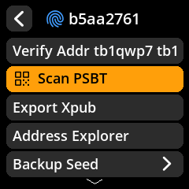

3. Point SeedSigner's camera at the animated QR code on your computer screen. Use the live preview to aim. The device reads multiple frames and reassembles the full transaction.

   

4. **Review the transaction carefully.** SeedSigner displays:

   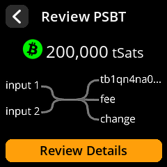

   Verify each of these items before proceeding:

   | Check | What to look for |
   |-------|-----------------|
   | **Recipient address** | Does it match your intended destination exactly? |
   | **Amount** | Is this the correct amount of Bitcoin to send? |
   | **Network fee** | Is the fee reasonable for current conditions? |
   | **Change address** | Does change return to your own wallet? |

   **Review Details** walks each part in turn:

   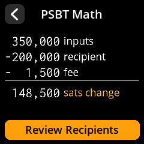

   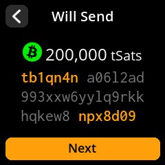

   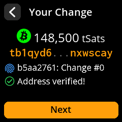

5. If multiple seeds are loaded, select the correct signing seed.

   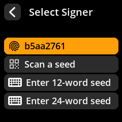

6. If everything looks correct, select **Approve PSBT** to sign.

   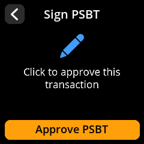

   SeedSigner adds the necessary signatures to the PSBT and encodes the result as a new animated QR code displayed on its screen.

7. Return to your coordinator and click **Scan QR**. Point your computer's webcam at SeedSigner's screen to scan the signed PSBT back in.

8. Your coordinator verifies the signatures. For a single-sig wallet, the transaction is now ready to broadcast. For a multi-sig wallet, repeat the signing process with additional cosigners until the required threshold is met.

9. Click **Broadcast Transaction** in your coordinator to send it to the Bitcoin network.

> **Warning:** Bitcoin transactions are irreversible once broadcast. Always double-check the recipient address character by character. Malware on your computer could swap addresses — this is exactly why you verify on SeedSigner's trusted screen.

## Warnings you may see during review

SeedSigner interrupts the review when something about the transaction deserves a
second look. None of these mean the transaction is invalid — they mean the device
could not confirm something on your behalf.

**No change output.** The transaction sends everything, leaving nothing to come
back. Legitimate when you are sweeping a wallet, suspicious otherwise.

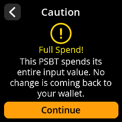

**Change address could not be verified.** SeedSigner derived your addresses and
did not find the change address among them. Check the wallet — for multisig,
confirm the [wallet descriptor](/reference/multisig/descriptor.md) is loaded.

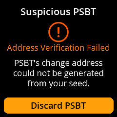

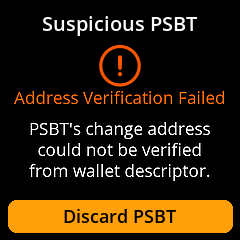

**Self-transfer address could not be verified.** Same check, for a transaction
sending back to your own wallet rather than producing change.

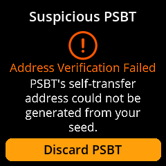

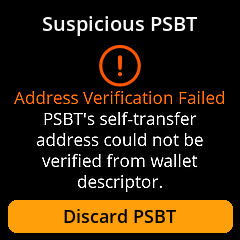

**Unsupported script type.** The PSBT uses an address format this firmware cannot
sign for.

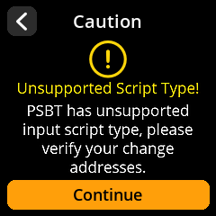

**Signing error.** The device could not produce a signature — most often because
the loaded seed is not one of the wallet's keys.

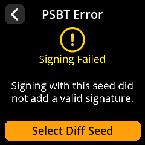

## Troubleshooting scanning issues

- **Glare on SeedSigner's screen?** Press the joystick up or down to adjust QR brightness.
- **Computer webcam can't read SeedSigner's QR?** In SeedSigner settings, try changing **QR Density** to "Low" for larger, easier-to-scan codes.
- **Low-quality webcam?** Adjust ambient lighting or try using a magnifying lens. Some budget laptop cameras struggle with small QR codes.

For more scanning tips, see [Common issues — QR code scanning problems](/help/common-issues.md#qr-code-scanning-problems).

## For multi-signature wallets

In a multi-sig setup (e.g. 2-of-3), you repeat the scan-review-sign-scan cycle for each required cosigner. Load a different seed into SeedSigner, scan the same PSBT, approve, and scan the new signature back into the coordinator. Once enough cosigners have signed, the coordinator enables the broadcast button.

See the [Multi-sig Spend Walkthrough](/reference/multisig/spending.md) for a detailed guide.
