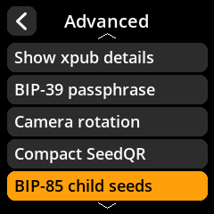
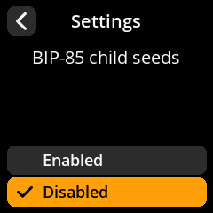
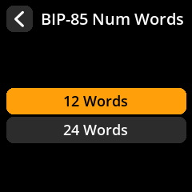
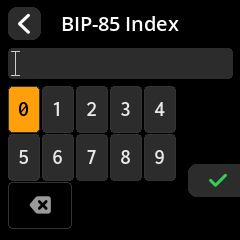
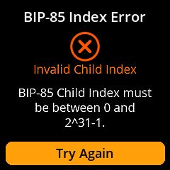

# BIP-85 child seeds

> Derive independent, reproducible BIP-39 seed phrases from a single master seed.

BIP-85 lets one carefully backed-up master seed act as a **seed factory**: from it, SeedSigner can deterministically derive any number of child seeds. Each child is a complete, standalone BIP-39 seed phrase — you can use it in any wallet, anywhere, as if it had been generated independently.

## Why use child seeds?

Because derivation is deterministic, **backing up the master seed backs up every child:** present and future. That enables patterns like:

- **One backup, many wallets.** Separate seeds for savings, spending, and experiments, all recoverable from the single master backup.
- **Seeds for other devices.** Provision a hot wallet or a second signing device with a child seed; if that device is lost or compromised, the master (and the other children) are unaffected.
- **Compartmentalized risk.** A child seed reveals nothing about its parent or its siblings. Someone who obtains child #3 cannot derive the master or child #4.

> **Warning:** The reverse is *not* true — anyone who obtains the **master** seed can regenerate **every child**. Guard the master at your highest security tier, and treat child seeds as strictly less critical than the master, never more.

## Enable the feature

BIP-85 is off by default. Turn it on at:

**Settings > Advanced > BIP-85 Child Seeds → Enabled**

## Derive a child seed

1. Load the master seed ([seed loading](/reference/seeds/loading.md)) or create one ([seed creation](/reference/seeds/creation.md)).
2. From the main menu select **Seeds** and choose the loaded master seed.
3. Select **BIP-85 Child Seed**.
4. Choose the child's length: **12 words** or **24 words**.

   

5. Enter the **index number** (0, 1, 2, …). The same master + length + index always produces the same child seed.

   

   Indexes outside the valid range are rejected rather than silently clamped:

   

6. SeedSigner displays the child's seed phrase. From here treat it like any other seed: write it down or export it as a [SeedQR](/reference/seeds/seedqr.md), and note **which index it is**.

> **Tip:** Record the index alongside each child's purpose (e.g. "index 0 = mobile spending, index 1 = savings"). The words themselves are recoverable from the master, but only if you remember which index to re-derive.

## Recovering a child seed later

You don't need the child's own backup as long as you have:

1. The **master seed** (and its passphrase, if any),
2. the child's **word count**, and
3. the child's **index number**.

Repeat the derivation steps above on any SeedSigner (or other BIP-85-capable tool) and the identical child phrase is reproduced.

## Good to know

- Child seeds are **standard BIP-39 seeds**. The receiving wallet doesn't need to know or support BIP-85.
- A child seed can have its own BIP-39 passphrase once loaded into a wallet, like any other seed.
- BIP-85 derivation is one-way: children cannot be combined or reverse-engineered to find the master.

## Related pages

- [Seed creation](/reference/seeds/creation.md): generating the master seed with camera or dice entropy.
- [SeedQR backup](/reference/seeds/seedqr.md): fast, scannable backups for master or child seeds.
- [Advanced settings](/reference/settings/advanced.md): the full settings reference, including this toggle.
