# Advanced settings

> Fine-grained control over network, QR codes, signature types, privacy, and more.

**Navigation:** Main Menu > Settings > Advanced

Most defaults work well out of the box — adjust these when you have a specific need.

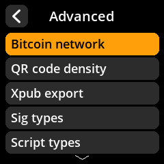

---

## Settings reference

| Setting | Path | Options | Default |
|---------|------|---------|---------|
| **Bitcoin Network** | Advanced | Mainnet, Testnet, Regtest | Mainnet |
| **QR Code Density** | Advanced | Low, Medium, High | Medium |
| **Xpub Export** | Advanced | Enabled, Disabled | Enabled |
| **Signature Types** | Advanced | Single Sig, Multisig, or both | Both enabled |
| **Script Types** | Advanced | Configure available script/address types | — |
| **Show Xpub Details** | Advanced | Enabled, Disabled | Enabled |
| **BIP-39 Passphrase** | Advanced | Enabled, Disabled, Required | Enabled |
| **Camera Rotation** | Advanced | 0°, 90°, 180°, 270° | 180° |
| **Compact SeedQR** | Advanced | Enabled, Disabled | Enabled |
| **BIP-85 Child Seeds** | Advanced | Enabled, Disabled | Disabled |
| **Electrum Seeds** | Advanced | Enabled, Disabled | Disabled |
| **Message Signing** | Advanced | Enabled, Disabled | Disabled |
| **Privacy Warnings** | Advanced | Enabled, Disabled | Enabled |
| **Dire Warnings** | Advanced | Enabled, Disabled | Enabled |
| **QR Brightness Tips** | Advanced | Enabled, Disabled | Enabled |
| **Partner Logos** | Advanced | Enabled, Disabled | Enabled |

---

## Details

### Bitcoin network

Select which Bitcoin network SeedSigner operates on.

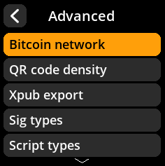

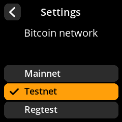

| Network | Purpose |
|---------|---------|
| **Mainnet** | Real Bitcoin. Use this for actual transactions. |
| **Testnet** | Development and testing with worthless test coins. |
| **Regtest** | Fully local testing environment, no network needed. |

> **Warning:** Always verify you are on **Mainnet** before signing real transactions. Signing on the wrong network can lead to confusion or lost funds.

### QR code density

Controls how much data is packed into each frame of an animated QR code.

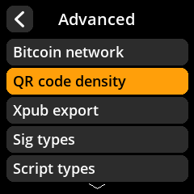

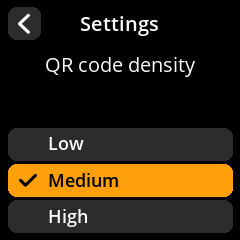

- **Low density:** Larger, simpler QR codes that are easier for cameras to scan. Best if you have scanning difficulties.
- **Medium density:** A balanced default for most setups.
- **High density:** More data per frame means fewer frames and faster transfers, but requires a good camera and steady hands.

> **Tip:** If your coordinator wallet struggles to scan QR codes from SeedSigner, try lowering the density.

### Xpub export

When enabled, SeedSigner allows you to export extended public keys (xpubs) to your coordinator wallet. This is required for setting up watch-only wallets.

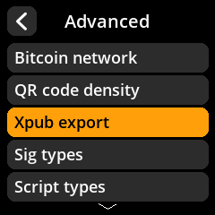

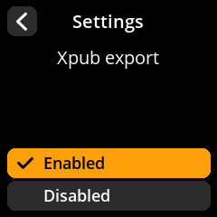

### Signature types

Control which signature schemes are available.

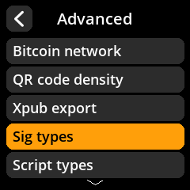

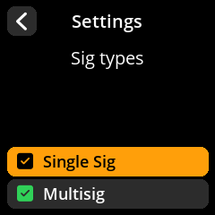

- **Single Sig:** Standard single-key signing.
- **Multisig:** Multi-key signing (e.g., 2-of-3 setups).

You can enable one or both depending on your workflow.

### Script types

Configure which script and address types are available for key export and signing. This lets you restrict SeedSigner to only the address formats you actually use.

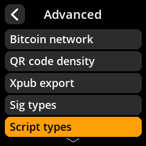

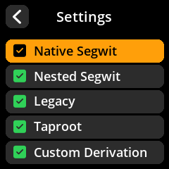

### Show xpub details

When enabled, SeedSigner displays detailed extended public key information during the export process, allowing you to verify the data before your coordinator wallet receives it.

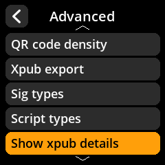

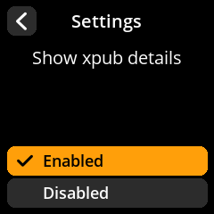

### BIP-39 Passphrase

Controls how SeedSigner handles the optional BIP-39 passphrase (sometimes called the "25th word").

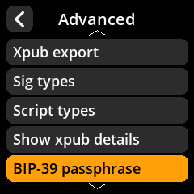

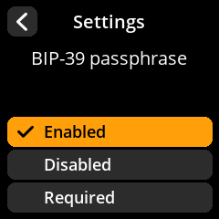

| Option | Behavior |
|--------|----------|
| **Enabled** | Passphrase entry is available but optional. You can choose to add one or skip it. |
| **Disabled** | Passphrase support is turned off entirely. Seeds are used without a passphrase. |
| **Required** | Every seed must have a passphrase. SeedSigner will always prompt for one. |

> **Tip:** If you always use a passphrase, setting this to **Required** prevents accidentally signing without one.

### Camera rotation

Adjust the camera image orientation. The default of 180° works for most standard builds where the camera ribbon cable exits toward the bottom of the device.

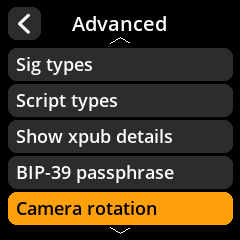

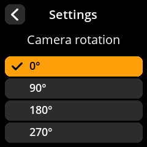

| Rotation | When to use |
|----------|-------------|
| **0°** | Image appears upside-down at 180° |
| **90°** | Camera mounted sideways (clockwise) |
| **180°** | Default — correct for most builds |
| **270°** | Camera mounted sideways (counter-clockwise) |

> **Tip:** If the camera preview looks upside-down or sideways, cycle through rotations until the image is right-side up.

### Compact SeedQR

When enabled, SeedSigner can generate and read the compact SeedQR format, which encodes seed data into a smaller, denser QR code. This is useful for metal backup plates and other physical storage methods.

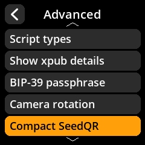

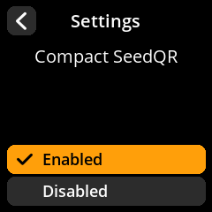

### BIP-85 child seeds

When enabled, SeedSigner can derive deterministic child seeds from a master seed using the BIP-85 standard. Each child seed is a fully independent BIP-39 seed that can be reproducibly generated from the parent.

> **Tip:** BIP-85 is useful for generating separate seeds for different purposes (e.g., one for savings, one for spending) all derived from a single master seed. Full guide: [BIP-85 child seeds](/reference/seeds/bip85.md).

### Electrum seeds

When enabled, SeedSigner supports the Electrum seed format in addition to the standard BIP-39 format. Keep this disabled unless you specifically use Electrum-format seeds.

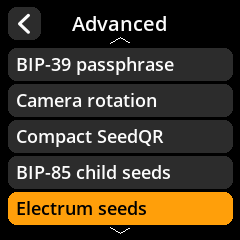

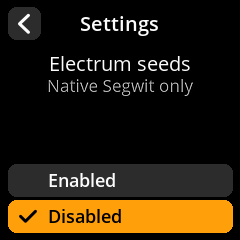

Once enabled, loading a seed offers the Electrum format as a separate path, which
warns you before proceeding — Electrum seeds are not BIP-39 and cannot be backed
up as a SeedQR:

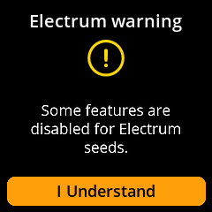

### Message signing

When enabled, SeedSigner can sign arbitrary text messages with a private key. This can be used to prove ownership of a Bitcoin address. Full guide: [Message signing](/reference/keys/message-signing.md).

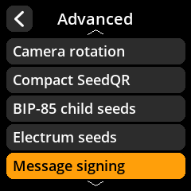

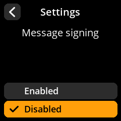

### Privacy warnings

Controls whether SeedSigner displays warnings about potential privacy implications during certain operations (for example, when an action might reveal information about your wallet).

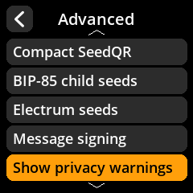

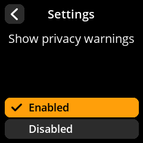

> **Tip:** Keep this enabled unless you are experienced and understand the privacy trade-offs involved.

### Dire warnings

Controls whether SeedSigner shows critical security warnings before potentially dangerous operations.

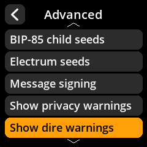

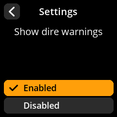

> **Warning:** Disabling dire warnings removes important safety guardrails. Keep this enabled unless you have a very specific reason to turn it off.

### QR brightness tips

When enabled, SeedSigner will show helpful reminders about adjusting screen brightness for better QR code scanning. These tips are especially useful when your coordinator wallet has trouble reading displayed QR codes.

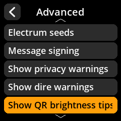

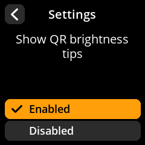

### Hardware

Display driver and colour options live in their own submenu. See
[Hardware settings](/reference/settings/hardware.md).

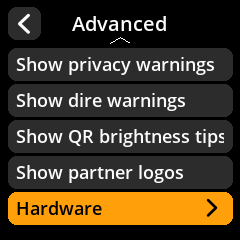

### Partner logos

Controls whether wallet partner logos (BlueWallet, Sparrow, etc.) are displayed in the interface. This is a cosmetic preference with no effect on functionality.

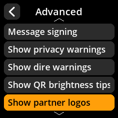

The difference shows on the splash screen at boot — with logos, then without:

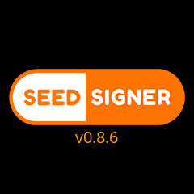
